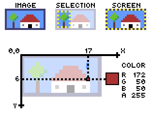

# Pixiq

[](https://circleci.com/gh/elgopher/pixiq)
[](https://pkg.go.dev/mod/github.com/elgopher/pixiq)
[](https://goreportcard.com/report/github.com/elgopher/pixiq)

Create Pixel Art games in Golang with fun and ease.

## What you can do with Pixiq?

+ draw images on a screen in real time using your favourite [Go programming language](https://golang.org/)
+ manipulate every single pixel directly or with the use of tools (_blend and clear supported at the moment_)
+ handle user input (_keyboard and mouse supported at the moment_)

## What is Pixel Art?

+ is the art of making digital images where the creator place every single pixel of the image
+ it is all about limits: low resolution, limited palette, no rotation besides square angles and only integer scaling
+ no automatic anti-aliasing, no filters, blur and other fancy tools
+ more information can be found in [The Pixel Art Tutorial](http://pixeljoint.com/forum/forum_posts.asp?TID=11299)

## Installation

+ [Go 1.14+](https://golang.org/dl/)
+ Ubuntu/Debian: `sudo apt-get install libgl1-mesa-dev xorg-dev gcc`
+ CentOS/Fedora: `sudo yum install libX11-devel libXcursor-devel libXrandr-devel libXinerama-devel mesa-libGL-devel libXi-devel gcc`
+ MacOS: `xcode-select --install`

## Hello world!

```
$ go mod init hello
$ go get -u github.com/elgopher/pixiq
```

```go
package main

import (
	"github.com/elgopher/pixiq/colornames"
	"github.com/elgopher/pixiq/glfw"
)

func main() {
	glfw.RunOrDie(func(openGL *glfw.OpenGL) {
		window, err := openGL.OpenWindow(80, 16, glfw.Zoom(5))
		if err != nil {
			panic(err)
		}
		for {
			screen := window.Screen()
			screen.SetColor(40, 8, colornames.White)
			window.Draw()
			if window.ShouldClose() {
				break
			}
		}
	})
}
```

More examples you can find in [examples](examples) directory.

## Basic primitives



## Project status

The project is under heavy development at the moment, and some of its features are experimental/missing
and may change in the near future.

The project is using [semantic versioning](https://semver.org/). Current version 
is `0.X.Y` which basically means that future versions may introduce incompatible 
API changes. More about architecture can be found in [architecture document](docs/architecture.md).

## Project goals

+ Create Go API which is just fun to use. It will provide tools known from Pixel Art software.
+ Create Development Tools similar to Chrome Developer Tools to support the development process
+ Make it fast - image manipulation requires a lot of computation, therefore Pixiq should be well optimized
+ Create a set of loosely coupled packages which can be used selectively and replaced or extended easily
